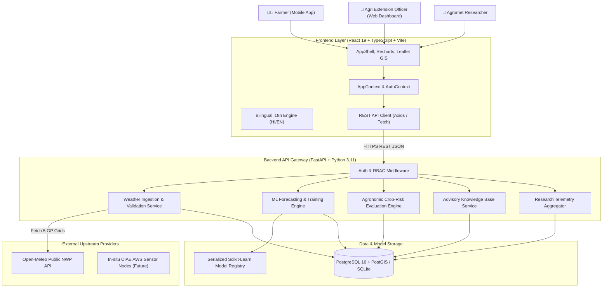
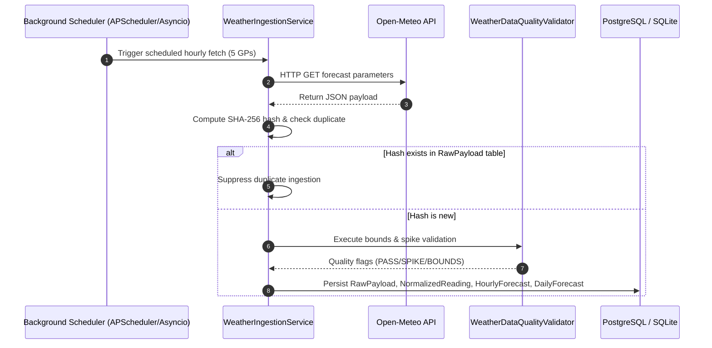
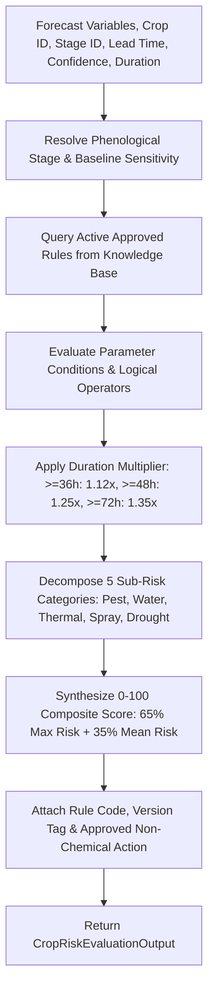

# System Architecture Blueprint

## PanchayatMausam AI (पंचायत मौसम AI)
### Technical Architecture, Data Flows, and Component Design

---

## 1. High-Level Architecture (C4 Model Context)



---

## 2. Layered Component Architecture

### 2.1 Client Layer (Presentation & State)
- **Framework**: React 19 with TypeScript 5.5, bundled via Vite 6.
- **Styling**: Tailwind CSS v4 with custom glassmorphic tokens and accessible contrast palettes.
- **Data Visualization**: Recharts (dual-axis meteorological charts, radar charts) and React-Leaflet (Panchayat polygon geo-boundaries).
- **Internationalization (`src/i18n/`)**: Custom zero-dependency dictionary engine supporting dynamic Hindi/English toggling and Web Speech API text-to-speech audio playback.
- **Dual-Mode Backend Connector (`src/config/api.ts`)**: Single configuration setting (`USE_BACKEND_API`) allowing instant switching between live FastAPI endpoints and offline local mock data.

### 2.2 Application Service Layer (FastAPI)
The backend is structured into domain repositories, validation services, and REST routers:

```
backend/app/
├── api/
│   ├── deps.py              # Dependency injection (DB session, JWT auth)
│   └── v1/                  # Versioned REST endpoints (12 modules)
├── core/
│   ├── config.py            # Pydantic Settings from environment variables
│   ├── database.py          # SQLAlchemy engine, session maker, base model
│   └── security.py          # Password hashing (bcrypt) & JWT issuance
├── db/
│   ├── seeds.py             # Baseline seed datasets for Phanda block
│   └── session.py
├── ml/
│   ├── dataset.py           # Synthetic historical dataset generator
│   ├── features.py          # Lag, rolling statistics & DOY harmonic engineering
│   └── models.py            # 5-algorithm benchmark training pipeline
├── models/                  # SQLAlchemy ORM models (12 tables)
├── repositories/            # Data access object (DAO) repositories
├── schemas/                 # Pydantic validation & serialization schemas
└── services/                # Business logic services
    ├── crop_risk_engine.py  # Rule-based agronomic evaluation engine
    ├── ml_service.py        # ML prediction & benchmark controller
    ├── research_service.py  # Research dashboard telemetry aggregator
    ├── weather_ingestion_service.py # Open-Meteo ingestion pipeline
    └── weather_scheduler.py # Background hourly cron job
```

---

## 3. Data Pipelines & Lifecycle

### 3.1 Automated Weather Ingestion Lifecycle (Phase 7)


### 3.2 Machine Learning Forecasting Pipeline (Phase 8)
1. **Dataset Synthesis & Ingestion**: Chronological daily weather observations ($N=730\text{ days}$).
2. **Feature Engineering (`backend/app/ml/features.py`)**:
   - Autoregressive lags: $t-1$, $t-2$, $t-3$ for all meteorological targets.
   - Rolling statistics: 7-day rolling mean, min, max, and standard deviation.
   - Trigonometric seasonality: $\sin(2\pi \cdot \text{DOY} / 365)$, $\cos(2\pi \cdot \text{DOY} / 365)$.
   - Soil moisture & surface barometric pressure lag vectors.
3. **Chronological Splitting**: $70\%$ Train (first 510 days) $\rightarrow$ $15\%$ Validation (next 110 days) $\rightarrow$ $15\%$ Test (last 110 days). Zero future-data leakage.
4. **Benchmark Model Training**:
   - Target 1: Precipitation (`rainfall_mm`)
   - Target 2: Max Temperature (`temp_max_c`)
   - Target 3: Min Temperature (`temp_min_c`)
   - Target 4: Relative Humidity (`humidity_pct`)
   - Target 5: Wind Speed (`wind_speed_kmh`)
5. **Champion Selection**: Algorithm with lowest validation MAE is serialized to disk and registered in `ml_model_registry`.

### 3.3 Rule-Based Crop-Risk Evaluation Engine (Phase 9)


---

## 4. Security & Scalability Blueprint

### 4.1 Security Architecture
- **Stateless Authentication**: Signed JSON Web Tokens (JWT) using `HS256` HMAC algorithm.
- **Password Security**: Salted hashes generated via `passlib[bcrypt]` with work factor 12.
- **CORS Protection**: Configurable allowed origins whitelist in `Settings.CORS_ORIGINS`.
- **Database Safety**: Parameterized queries via SQLAlchemy ORM preventing SQL injection.

### 4.2 Scalability & Deployment Topologies
- **Development**: Single-node SQLite local database with instant hot-reloading.
- **Production (Docker Compose)**: Multi-container deployment with PostgreSQL 16 + PostGIS, connection pooling (`pool_size=20`), and Nginx caching for static web assets.
- **Cloud PaaS (Render / Railway)**: Containerized web service with automated TLS termination and persistent volumes for serialized ML model weights.
