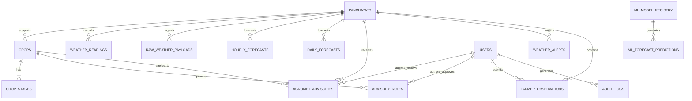

# Database Architecture & Schema Specification

## PanchayatMausam AI (पंचायत मौसम AI)
### Relational & Spatial Database Design (PostgreSQL 16 + PostGIS & SQLite)

---

## 1. Entity-Relationship Diagram (ERD)



---

## 2. Table Specifications

### 2.1 `panchayats` Table
Stores Gram Panchayat spatial coordinates, elevation, and soil profiles.

| Column | Type | Constraints | Description |
| :--- | :--- | :--- | :--- |
| `id` | `VARCHAR(64)` | `PRIMARY KEY` | Unique ID (e.g. `panchayat_acharpura`) |
| `name_en` | `VARCHAR(128)` | `NOT NULL` | English name (Acharpura) |
| `name_hi` | `VARCHAR(128)` | `NOT NULL` | Hindi name (आचारपुरा) |
| `block` | `VARCHAR(64)` | `NOT NULL` | Administrative block (`Phanda`) |
| `district` | `VARCHAR(64)` | `NOT NULL` | District (`Bhopal`) |
| `state` | `VARCHAR(64)` | `NOT NULL` | State (`Madhya Pradesh`) |
| `latitude` | `FLOAT` | `NOT NULL` | Centroid latitude ($23.3685$) |
| `longitude` | `FLOAT` | `NOT NULL` | Centroid longitude ($77.3712$) |
| `elevation_m` | `FLOAT` | `NOT NULL` | Terrain elevation in meters ($512.0$) |
| `weather_station_id` | `VARCHAR(64)` | `NOT NULL` | Associated AWS node (`AWS-BPL-ACH-01`) |
| `soil_type_en` | `VARCHAR(128)` | `NOT NULL` | Regional soil classification (`Deep Vertisol Clay`) |
| `soil_type_hi` | `VARCHAR(128)` | `NOT NULL` | Hindi soil description |
| `bbox_json` | `TEXT` | `NOT NULL` | Bounding box coordinates $[minX, minY, maxX, maxY]$ |
| `boundary_geojson` | `TEXT` | `NOT NULL` | GeoJSON Polygon of Panchayat boundary |

---

### 2.2 `crops` & `crop_stages` Tables
Stores crop agronomy, calendar windows, and phenological sensitivity.

#### `crops`
| Column | Type | Constraints | Description |
| :--- | :--- | :--- | :--- |
| `id` | `VARCHAR(64)` | `PRIMARY KEY` | e.g. `soybean`, `wheat`, `chickpea` |
| `name_en` | `VARCHAR(128)` | `NOT NULL` | English display name |
| `name_hi` | `VARCHAR(128)` | `NOT NULL` | Hindi display name |
| `botanical_name` | `VARCHAR(128)` | `NULLABLE` | e.g. *Glycine max* |
| `season` | `VARCHAR(32)` | `NOT NULL` | `kharif`, `rabi`, `zaid` |
| `typical_sowing_window_en` | `VARCHAR(128)` | `NOT NULL` | e.g. "15 June – 05 July" |
| `total_duration_days` | `INTEGER` | `NOT NULL` | e.g. 95 days for Soybean |
| `primary_risks_en_json` | `TEXT` | `NOT NULL` | JSON array of key threats |

#### `crop_stages`
| Column | Type | Constraints | Description |
| :--- | :--- | :--- | :--- |
| `stage_id` | `VARCHAR(64)` | `PRIMARY KEY` | e.g. `soy_germination`, `wht_cri` |
| `crop_id` | `VARCHAR(64)` | `FOREIGN KEY` | References `crops.id` |
| `order_index` | `INTEGER` | `NOT NULL` | Sequential order (1..7) |
| `name_en` | `VARCHAR(128)` | `NOT NULL` | English stage title |
| `name_hi` | `VARCHAR(128)` | `NOT NULL` | Hindi stage title |
| `typical_duration_days` | `INTEGER` | `NOT NULL` | Typical stage duration |
| `water_sensitivity` | `VARCHAR(32)` | `NOT NULL` | `low`, `moderate`, `high`, `critical` |
| `thermal_sensitivity` | `VARCHAR(32)` | `NOT NULL` | `low`, `moderate`, `high`, `critical` |

---

### 2.3 `advisory_rules` Table (Knowledge Base)
Stores dynamic agricultural rules, JSON condition thresholds, and provenance citations.

| Column | Type | Constraints | Description |
| :--- | :--- | :--- | :--- |
| `id` | `VARCHAR(64)` | `PRIMARY KEY` | e.g. `rule_soy_001` |
| `rule_code` | `VARCHAR(64)` | `UNIQUE, NOT NULL` | e.g. `RULE-SOY-POD-001` |
| `crop_id` | `VARCHAR(64)` | `NOT NULL, INDEX` | References crop or `all` |
| `stage_id` | `VARCHAR(64)` | `NOT NULL` | References stage or `all` |
| `weather_trigger_en` | `TEXT` | `NOT NULL` | Human-readable meteorological trigger |
| `thresholds_json` | `TEXT` | `NOT NULL` | JSON array of `{parameter, operator, value, unit}` |
| `risk_category` | `VARCHAR(64)` | `NOT NULL` | `pest_disease`, `excess_water`, `thermal_stress`, etc. |
| `severity` | `VARCHAR(32)` | `NOT NULL` | `normal`, `advisory`, `warning`, `critical` |
| `short_summary_en` | `VARCHAR(256)` | `NOT NULL` | Short risk summary (English) |
| `short_summary_hi` | `VARCHAR(256)` | `NOT NULL` | Short risk summary (Hindi) |
| `recommended_action_en` | `TEXT` | `NOT NULL` | Approved non-chemical recommendation (English) |
| `recommended_action_hi` | `TEXT` | `NOT NULL` | Approved non-chemical recommendation (Hindi) |
| `source_org_en` | `VARCHAR(256)` | `NOT NULL` | e.g. *ICAR-IISR Indore* |
| `source_ref_en` | `VARCHAR(256)` | `NOT NULL` | e.g. *Bulletin #42 (Section 3.2)* |
| `version` | `VARCHAR(32)` | `DEFAULT 'v1.0'` | e.g. `v1.3` |
| `approval_status` | `VARCHAR(32)` | `DEFAULT 'draft'` | `draft`, `pending_review`, `approved`, `published` |
| `version_history_json` | `TEXT` | `NULLABLE` | JSON audit log of modifications |

---

### 2.4 `ml_model_registry` Table
Stores metadata, hyperparameters, and benchmark evaluation metrics for all trained models.

| Column | Type | Constraints | Description |
| :--- | :--- | :--- | :--- |
| `id` | `VARCHAR(64)` | `PRIMARY KEY` | e.g. `mod-rf-rain-v1.0.0` |
| `model_name` | `VARCHAR(128)` | `NOT NULL` | e.g. `RandomForest-Rainfall-Phanda` |
| `target_variable` | `VARCHAR(64)` | `NOT NULL, INDEX` | `rainfall_mm`, `temp_max_c`, `humidity_pct`, etc. |
| `algorithm_type` | `VARCHAR(64)` | `NOT NULL` | `random_forest`, `gradient_boosting`, `linear_regression` |
| `version_tag` | `VARCHAR(32)` | `DEFAULT 'v1.0.0'` | Semantic version |
| `is_active_champion` | `BOOLEAN` | `DEFAULT FALSE` | True if selected as primary production model |
| `mae` | `FLOAT` | `NOT NULL` | Mean Absolute Error on test set |
| `rmse` | `FLOAT` | `NOT NULL` | Root Mean Squared Error on test set |
| `r2_score` | `FLOAT` | `NOT NULL` | Coefficient of Determination ($R^2$) |
| `risk_classification_f1` | `FLOAT` | `DEFAULT 0.0` | Macro F1 score on risk classification |
| `hyperparameters_json` | `TEXT` | `NOT NULL` | Serialized model parameters |
| `trained_at` | `DATETIME` | `NOT NULL` | UTC training timestamp |

---

## 3. Database Indexes & Performance Optimization

```sql
-- Indexes for Fast Hyperlocal Queries
CREATE INDEX idx_weather_panchayat_ts ON weather_readings (panchayat_id, timestamp DESC);
CREATE INDEX idx_forecast_panchayat_target ON hourly_forecasts (panchayat_id, forecast_for_time);
CREATE INDEX idx_daily_forecast_panchayat_date ON daily_forecasts (panchayat_id, forecast_date);
CREATE INDEX idx_rules_crop_stage ON advisory_rules (crop_id, stage_id, approval_status);
CREATE INDEX idx_raw_payload_hash ON raw_weather_payloads (payload_sha256);
CREATE INDEX idx_ml_champion_target ON ml_model_registry (target_variable, is_active_champion);
```

---

## 4. Alembic Migration Workflow

Database migrations are managed via Alembic:
```bash
# Create a new migration revision
alembic revision --autogenerate -m "add_crop_risk_engine_fields"

# Apply all pending migrations to database
alembic upgrade head

# Rollback single migration
alembic downgrade -1
```
